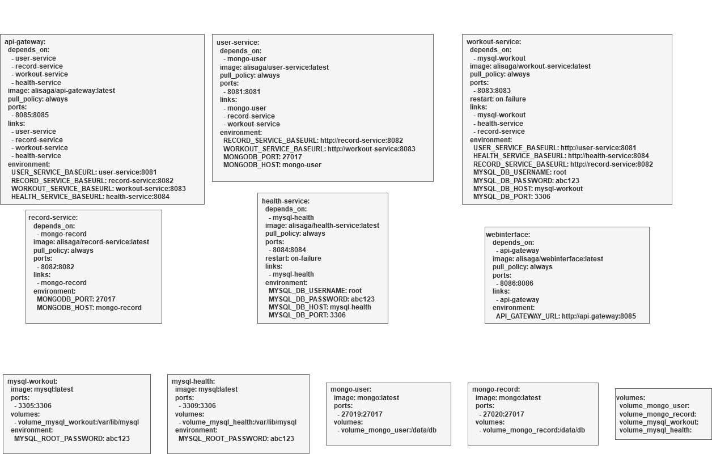

# Advanced-Programming-Topics-2024

This project allows users to track their fitness journey by logging personal progress and viewing detailed statistics over time. The system provides users with an easy way to monitor their health-related activities, track workouts, and visualize their personal records.

## Contributors
- **Magomed-Ali Dudayev**: [AliDudayev](https://github.com/AliDudayev)
- **Marnick Michielsen**: [MarnickM](https://github.com/MarnickM)

---

## Project Overview

The application consists of a microservices architecture built with Docker Compose. The primary goal is to ensure modularity, scalability, and maintainability by segregating core functionalities into different services. Users can interact with the system through a unified web interface that communicates with the services via an API Gateway.

### Key Features:
- **User Management**: Create, update, and manage users.
- **Health Tracking**: Log and view health records.
- **Workout Management**: Log workouts and retrieve workout statistics.
- **Record Keeping**: Maintain a history of personal records made during a workout of each user.

---

## Technologies Used

### Backend
- **Spring Boot**: Framework for microservices implementation.
- **Spring Cloud Gateway**: Handles API Gateway routing and filters.
- **OAuth2**: Used for secure authentication and authorization.

### Frontend
- **Web Interface**: A Spring Web framework with Thymeleaf for user interaction.

### Databases
- **MySQL**: Used for the `health-service` and `workout-service`.
- **MongoDB**: Used for the `user-service` and `record-service`.

### Deployment
- **Docker Compose**: Orchestrates multi-container Docker applications for local deployment.

---

## Architecture Diagram

The system's deployment diagram illustrates the integration of various microservices, their databases, and how they are connected via the API Gateway. Below is a visual representation of the architecture:


---

## Services and Endpoints

### **All Endpoints (some are not in the gateway as they function internally)**

#### Health Service
- **GET** `/health/all` -> Get all health records
- **GET** `/health` -> Get a health record
- **POST** `/health` -> Save a health record
- **PUT** `/health` -> Update a health record

#### Record Service
- **GET** `/record/all` -> Get all records
- **GET** `/record` -> Get a record
- **POST** `/record` -> Save a record
- **PUT** `/record` -> Update a record
- **DELETE** `/record` -> Delete a record

#### User Service
- **GET** `/user/all` -> Get all users
- **GET** `/user` -> Get a user
- **POST** `/user` -> Save a user
- **PUT** `/user` -> Update a user
- **DELETE** `/user` -> Delete a user
- **GET** `/user/record` -> Get the record of a user (from record-service)
- **GET** `/user/record/all` -> Get all records (from record-service)
- **POST** `/user/record` -> Save a record of a user (in record-service)
- **PUT** `/user/record` -> Update a record of a user (in record-service)
- **DELETE** `/user/record` -> Delete a record of a user (in record-service)
- **GET** `/user/workout` -> Get all workouts from a user (from workout-service)

#### Workout Service
- **GET** `/workout/all` -> Get all workouts
- **GET** `/workout` -> Get a workout
- **POST** `/workout` -> Save a workout
- **GET** `/workout/user` -> Get workouts by user
- **GET** `/workout/health` -> Get health record of a workout (from health-service)

---
## Docker Compose structure

In the image below, you can see how our docker compose file is structured to build the entire setup.



---

## How to Run Locally

1. **Clone the Repository:**
   ```bash
   git clone https://github.com/AliDudayev/Advanced-Programming-Topics-2024.git
   cd Advanced-Programming-Topics-2024
   ```

2. **Set Up Environment Variables:**
   Create a `.env` file in the root directory with the following variables:
   ```env
   GOOGLE_CLIENT_ID=<your-google-client-id>
   GOOGLE_CLIENT_SECRET=<your-google-client-secret>
   HEALTH_SERVICE_BASEURL=localhost:8084
   RECORD_SERVICE_BASEURL=localhost:8082
   USER_SERVICE_BASEURL=localhost:8081
   WORKOUT_SERVICE_BASEURL=localhost:8083
   ```

3. **Start Services with Docker Compose:**
   ```bash
   docker-compose up -d
   ```

4. **Access the Web Interface:**
   Navigate to `http://localhost:8086` in your web browser.
   Note, not all endpoints are available in the webbrowser. Only the ones that support the goal of our webinterface are integrated, all others can be reached via Postman though.

5. **Getting a valid token for authentication:**
   Open Postman an make a new request, in the `authorization tab` select `OAuth 2.0`.
   
   

   After this scroll down to `configure new token` and fill in the following URLs and credentials. Note, you will need to first setup OAuth2 in your Google project to get these URLs and credentials.
   
   

   Finally press on the `Get new access token` button at the bottom to get your token.
   
   

---

## Frontend


